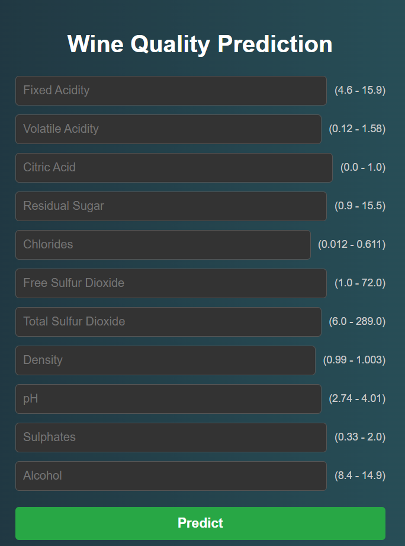

# AI-Powered Wine Quality Predictor

Have you ever wondered what makes a great wine? This project dives into that question by using machine learning to predict the quality of red wine based on its chemical properties. I've built a simple and elegant web application that lets you input a wine's stats and get an instant quality score.

---

## A Quick Look

Here’s a snapshot of the application. Simply enter the wine's chemical details to see what the model thinks of its quality!

---

## How It's Built: The Methodology

This project followed a structured approach, from understanding the data to fine-tuning the models for the best possible performance.

#### 1. Data Exploration and Preparation
The process began with the **"Vinho Verde" red wine dataset**, containing **1599 samples**. The first step was to understand the data's structure and check for issues like missing values. I analyzed the distribution of each chemical feature and its correlation with wine quality. A key finding was the class imbalance in the quality scores (our predicted classes, ranging from **3 to 8**), which required careful consideration during model training.

#### 2. Model Selection
I focused on tree-based ensemble methods, which are powerful for this type of classification task. The two models chosen for experimentation were:
-   **Decision Tree Classifier:** A simple yet effective model that creates a tree-like structure of decisions.
-   **Random Forest Classifier:** A more robust model that builds an entire "forest" of decision trees and combines their outputs to reduce overfitting and improve accuracy.

#### 3. Hyperparameter Tuning: The Quest for Perfection
A model is only as good as its tuning. I used two different automated techniques to find the best possible settings (hyperparameters) for each model:
-   For the **Decision Tree**, I used **GridSearchCV**. This method exhaustively searches through a manually specified grid of parameters to find the combination that yields the highest accuracy.
-   For the **Random Forest**, I used **Optuna**, a modern optimization framework. Optuna uses a more intelligent search strategy to efficiently explore a wide range of hyperparameters and find the optimal set. This advanced tuning is why the Random Forest ultimately became the final, most accurate model for the web application.

#### 4. Final Model Training and Deployment
After identifying the best hyperparameters, the final Random Forest model was trained on the entire dataset. This model was then saved as a `.pkl` file and integrated into a **Flask web application**, which provides the user-friendly interface for making live predictions.

---

## Model Performance

After extensive hyperparameter tuning, here are the final accuracy scores for the models on the test set:

| Model | Test Accuracy |
| :--- | :--- |
| **Random Forest Classifier (with Optuna)** | **90.31%** |
| **Decision Tree Classifier (with GridSearchCV)** | 86.87% |

---

## Input Parameter Ranges

To get the most accurate prediction, it's best to use values within the ranges the model was trained on. Here are the typical values from the dataset:

| Chemical Property | Min Value | Max Value |
| :--- | :--- | :--- |
| **Fixed Acidity** | 4.6 | 15.9 |
| **Volatile Acidity**| 0.12 | 1.58 |
| **Citric Acid** | 0.0 | 1.0 |
| **Residual Sugar**| 0.9 | 15.5 |
| **Chlorides** | 0.012 | 0.611 |
| **Free Sulfur Dioxide**| 1.0 | 72.0 |
| **Total Sulfur Dioxide**| 6.0 | 289.0 |
| **Density** | 0.99007 | 1.00369 |
| **pH** | 2.74 | 4.01 |
| **Sulphates** | 0.33 | 2.0 |
| **Alcohol** | 8.4 | 14.9 |
